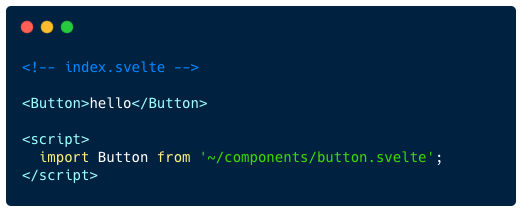
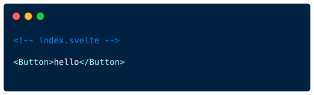

# sveltekit-autoimport


Automatically detect and import components/modules for <a href="https://kit.svelte.dev/">SvelteKit</a> projects.

### Before



### After




## Installation

```bash
npm i -D sveltekit-autoimport
```

## Basic configuration

Inside `vite.config.js`.

```js
import { sveltekit } from '@sveltejs/kit/vite';
import autoImport from 'sveltekit-autoimport';

export default {
  plugins: [
    autoImport({
      components: ['./src/components'],
    }),
    // must be placed before sveltekit()
    sveltekit()
  ]
}
```

## How it works?

This tool will **NOT** add global components blindly into your files.
Instead, it searches for **undefined** components or modules,
and then try to fix them by auto importing.

#### You need to guide it where to import the components from:

```js
autoImport({
  components: ['./src/components']
})
```

#### Or tell it how to import for some specific variables:

```js
autoImport({
  mapping: {
    API: `import API from '~/api/api.js'`,
    MY_FUNCTION: `import MY_FUNCTION from 'lib/my-function'`
  }
})
```

#### Or explictly list the components being used from a third party module:

```js
autoImport({
  module: {
    'carbon-components-svelte': [
      'Button',
      'Accordion',
      'AccordionItem',
      'Grid as CarbonGrid', /* rename */
    ]
  }
})
```

## Name strategy

By default the component names will be **namespaced** with their directory names and
then normalized to **upper camel case** format. For example:

```html
<MyComponent />
<!-- my-component.svelte -->

<MyAnotherComponent />
<!-- my_another_component.svelte -->

<FormInput />
<!-- form/input.svelte -->

<Modal />
<!-- modal/index.svelte -->
```

## Prefix

Components can be prefixed with a given name.

```js
autoImport({
  components: [{ name: './src/components', prefix: 'shared' } ],
})
```

So that

```html
<SharedComponent />
<!-- component.svelte -->

<SharedFormInput />
<!-- form/input.svelte -->
```

## Flat

If the `flat` option is set to be true, no namespace will be added.

```js
autoImport({
  components: [{ name: './src/components', flat: true } ],
})
```

So that

```html
<Input />
<!-- form/input.svelte -->

<Popup />
<!-- modal/inline/popup.svelte -->

```

## Full options

```js
// vite.config.js

import { sveltekit } from '@sveltejs/kit/vite';
import autoImport from 'sveltekit-autoimport';

export default {
  plugins: [
    autoImport({

      // where to search for the components
      components: [
        './src/components',
        './src/routes/_fragments',
        { name: './src/lib', flat: true, prefix: 'lib' },
      ],

      // some frequently used modules
      module: {
        svelte: ['onMount', 'createEventDispatcher']
      },

      // manually import
      mapping: {
        API:  `import API from '~/src/api'`,
        Icon: `import * as Icon from '$components/icon'`,
      },

      // autoimport only for .svelte files
      // and only search for .svelte files inside components
      include: ['**/*.svelte'],

      // node_modules is ignored by default
      exclude: ['**/node_modules/**'],

    }),

    sveltekit()
  ]
}
```


## Example

https://stackblitz.com/edit/vitejs-vite-tfpzge?file=src%2Froutes%2F%2Bpage.svelte
