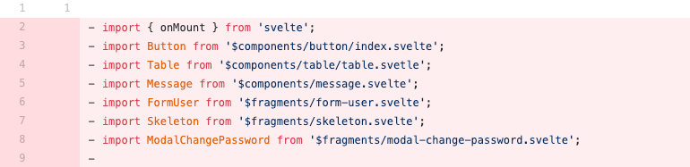

# vite-plugin-autoimport

Automatically detect and import components or modules.



## Motivation

It's very common to have many components in one file as the project grows,
and several frequently-used modules may be imported in almost every file.
Therefore, this plugin is for reducing the code of imports. You can treat those
components as global but they're being injected locally whenever required.

## Install

```bash
npm i -D vite-plugin-autoimport
```

## Example

```js
const { autoImport } = require('vite-plugin-autoimport');

// svelte.config.cjs
vite: {
  plugins: [
    autoImport({

      // where to search for the components
      components: [
        './src/components',
        './src/routes/_fragments',
      ],

      // some frequently used modules
      module: {
        svelte: ['onMount', 'createEventDispatcher']
      },

      // manually import
      mapping: {
        API:  `import API from './src/api'`,
        Icon: `import * as Icon from '$lib/icon'`,
      },

      // autoimport only for .svelte files
      include: ['**/*.svelte'],

      // node_modules is ignored by default
      exclude: ['node_modules'],

    })
  ]
}
```

## Name conventions

Component names will be normalized to **upper camel case**, for example:

```js
import MyComponent from '../my-component.svelte'
import MyAnotherComponent from '../my_another_component.svelte'
```

## Feature

* Can detect new created components without restart the dev server.

## Note

I only use it for `SvelteKit` projects. PRs are welcome for adding support to `vue`.


## TODO

- Add sourcemap
